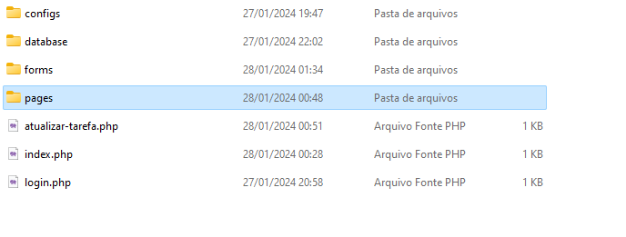

# PROJETO PARTE - 1 Criando Estrutura de um projeto e página de login
## Assuntos abordados
- Estrutura de um projeto
- Criando o projeto
- Constantes
- Template de página
- Criação de uma página de login
---
## Estrutura de um projeto
Na programação, a estrutura de um projeto é a organização dos arquivos e pastas que compõem o projeto. Existem várias formas de se estruturar um projeto PHP, mas vamos seguir o padrão que eu vou colocar abaixo:

meu_projeto/

│-- configs/
│   
│
│-- database/
│   
│
│-- forms/
│   
│
│-- pages/
│------ template/
│	
│   

│-- index.php
## Criando o projeto

Abra a pasta ``C:\xampp\htdocs`` e crie uma pasta chamada ``meu_projeto``. Dentro dela, crie as pastas ``configs``, ``database``, ``forms``, ``pages`` e dentro de ``pages`` crie a pasta ``template``.

deve ficar assim:



Ignore os arquivos da imagem por enquanto.

## Configs

A pasta ``configs`` vai conter arquivos de configuração do projeto. Por enquanto, vamos criar um arquivo chamado ``init.php``, ```config.php```,
```sessao.php``` e ```funcoes.php```.

### config.php

O arquivo ``config.php`` vai conter as constantes do projeto. Vamos criar até o momento, 3 constantes: ``RAIZ``, ```SERVER_ROOT``` e ```PAGE_URL```.

```php
<?php
define("RAIZ", dirname(__DIR__, 2));
define("SERVER_ROOT", "http://localhost/meu_projeto/");
define("PAGE_LOGIN", SERVER_ROOT . "login.php");
?>
```

**O texto final da constante SERVER_ROOT 'meu_projeto' é referente a pasta raiz que você cria conforme a estrutura do projeto. Caso você tenha criado a pasta com outro nome, você deve alterar o texto final da constante SERVER_ROOT para o nome da pasta que você criou. Exemplo:**

```php
define("SERVER_ROOT", "http://localhost/nome_da_pasta/");
```


### init.php

O arquivo ``init.php`` vai ser responsável por inicializar o projeto. Ele vai incluir o arquivo de configuração e o arquivo de funções. Crie o arquivo ``init.php`` dentro da pasta ``Configs`` e coloque o seguinte código:

```php
<?php
require_once("config.php");
require_once("sessao.php");
require_once("funcoes.php");
?>
```
## Criando template

Um template é um arquivo que contém a estrutura HTML de uma página. Ele é utilizado para que você não precise repetir o código HTML em todas as páginas do seu site e também para facilitar a manutenção do site. Com isso, todas as páginas que herdam de um template terão a mesma estrutura, e você só precisará mudar o conteúdo.

**O que se repete em toda estrutura HTML?**

- Head
- Footer
- Header (mas esse não agora)

Sabendo o que se repete, vamos criar 3 arquivos dentro da pasta ``template``: ``head.php``, ``footer.php`` e ``header.php``.

### head.php
No arquivo ``head.php`` devemos colocar o HTML até o fim da tag ``<head>`` pois esse é o objetivo desse arquivo: guardar somente a parte do cabeçalho do HTML.

```php
<!DOCTYPE html>
<html lang="pt-BR">

<head>
	<meta charset="UTF-8">
	<meta name="viewport" content="width=device-width, initial-scale=1.0">
	<link href="https://cdn.jsdelivr.net/npm/bootstrap@5.3.0/dist/css/bootstrap.min.css" rel="stylesheet">
	<script src="https:/cdn.jsdelivr.net/npm/bootstrap@5.3.0/dist/js/bootstrap.bundle.min.js"></script>
	<link rel="stylesheet" href="">
	<title><?php echo $title ?></title>
</head>
```
Veja que nós já importamos o Bootstrap 5.3.0, que é a versão que estamos  usando em aula.

**Agora PRESTE ATENÇÃO:** Está vendo a tag ``<title>``? Ela está com um ``<?php echo $title ?>``. Isso é uma variável que vamos passar para o template. Isso é muito importante, pois assim podemos mudar o título da página de acordo com a página que estamos acessando. Entenda que a variável não existe ainda, mas
toda página que herdar desse template vai ter que passar essa variável para o template se não vai dar erro.

### footer.php

No arquivo ``footer.php`` devemos colocar o fechamento da tag  ```<html>```. 

```php
	</html>
```

Você deve estar se perguntando: "E o ``<body>``?". O ``<body>`` não vai aqui, pois ele vai ser colocado na página que herdar desse template.

### header.php

Não vamos mexer nele agora, mas ele vai ser o cabeçalho do nosso site. Ele vai conter o menu de navegação e o logo do site.

## Criando a página de login

Agora que temos o template, vamos criar a página de login. Crie um arquivo chamado ``page_login.php`` dentro da pasta ``pages``. Estamos usando essa nomeclatura para ficar mais fácil de entender o que é cada arquivo pois vai ter mais de um arquivo que possui o nome ``login``, veremos isso mais pra frente. Dentro do arquivo ``page_login.php`` coloque o seguinte código:

```php
<body class="vh-100 bg-light">
	<div class="container h-100 d-flex justify-content-center align-items-center flex-column">
		<h3 class="text-center">Login</h3>
		<form class="d-flex flex-column gap-2 p-4" style="min-width:360px" action="" method="POST">
			<input class="form-control" name="email" type="email" placeholder="Email">
			<input class="form-control" name="senha" type="password" placeholder="Senha">
			<button class="btn btn-success" type="submit">Login</button>
			<p class="text-center">Não tem uma conta? <a href="cadastro.php">Cadastre-se</a></p>
		</form>
	</div>
</body>
```

Essa é a estrutura básica da página de login. Ela contém um formulário com os campos de email e senha e um botão de login. Também tem um link para a página de cadastro.

Veja que só colocamos o ``<body>`` e o conteúdo da página. O ```<head>``` e o ```<footer>``` precisa ser incluído. Para dar fazer com que a página de login herde do template, precisamos incluir o ``head.php`` e o ``footer.php`` no arquivo ``page_login.php``. Para isso, coloque o seguinte código no início e no final do arquivo ``page_login.php`` respectivamente:

```php
<?php require_once("template/head.php"); ?>
// html da página
<?php require_once("template/footer.php"); ?>
```

**Agora quero que preste atenção:**  Os arquivos que ficarão dentro da pasta ``pages`` serão somente os arquivos que contém o conteúdo da página. Precisamos de outro arquivo para fazer inicialização do projeto, definição de título da página e inclusão do conteúdo da página. Cada página vai ter um arquivo que vai fazer isso.  Por exemplo, a página de login vai ter um arquivo chamado ``login.php`` que além de outras coisas, vai chamar o arquivo ``page_login.php`` para mostrar o conteúdo da página.

Esses arquivos "controladores" vão ficar na raiz do projeto. Vamos criar o arquivo ``login.php`` na raiz do projeto.

- Incluir arquivo de inicialização do projeto
```php
require_once("configs/init.php"); 
```
- Definir o título da página
```php
$title = "Login";
```
- Incluir o conteúdo da página
```php
require_once("pages/page_login.php"); 
```

Siga a ordem acima acima colocando um abaixo do outro. Os arquivos que começararem com código php deve obrigatoriamente abrir ```<?php``` antes de começar a escrever o código e fechar ```?>``` caso precise escrever algo em HTML.